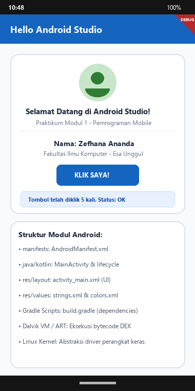
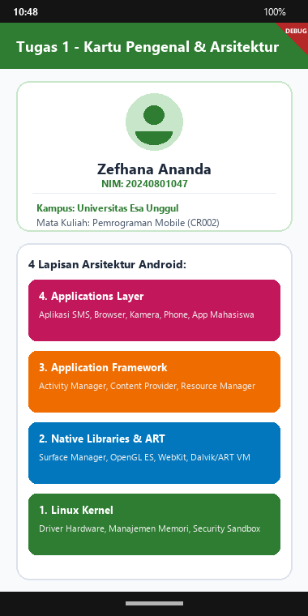

# Doc Tugas - Pertemuan 1: Pengenalan Konsep Dasar Android & Tools

- **Nama Mahasiswa**: Zefhana Ananda
- **NIM**: 20240801047
- **Dosen Pengampu**: Jefry Sunupurwa Asri, S.Kom., M.Kom.
- **Mata Kuliah**: Pemrograman Mobile (CR002)
- **Fakultas**: Fakultas Ilmu Komputer, Universitas Esa Unggul

---

## Tangkapan Layar Hasil Running Aplikasi

### 1. Hasil Praktikum: Hello Android Studio


### 2. Hasil Tugas: Kartu Pengenal & Arsitektur Android


---

## BAB I: Pendahuluan & Tujuan Pembelajaran
1. Mengenal dasar-dasar pembuatan aplikasi Android.
2. Mengetahui sejarah dan perkembangan Android dari awal sampai sekarang.
3. Memahami 4 lapisan arsitektur Android.
4. Mengetahui struktur folder project di Android Studio (manifests, java, res, gradle).
5. Membuat aplikasi Hello Android dan tugas kartu profil yang menampilkan arsitektur Android.

---

## BAB II: Dasar Teori
Android itu sistem operasi yang dibangun pakai kernel Linux dan bersifat open-source. Arsitekturnya terdiri dari 4 layer:
1. Linux Kernel: Bagian paling bawah, tugasnya mengatur hardware kayak kamera, layar, Wi-Fi, dan mengatur memori serta keamanan aplikasi.
2. Native Libraries & Android Runtime: Berisi pustaka C/C++ seperti OpenGL ES dan Media Framework. Di sini juga ada Dalvik VM atau ART yang menjalankan file DEX.
3. Application Framework: Kumpulan API yang bisa kita pakai buat bikin aplikasi, misalnya Activity Manager buat siklus hidup app, Content Provider buat tukar data, dan Resource Manager.
4. Applications: Lapisan paling atas yang langsung dilihat user, tempat aplikasi bawaan (SMS, Dialer) dan aplikasi buatan developer berjalan.

---

## BAB III: Pelaksanaan Praktikum (Hello Android Studio)
Di praktikum ini, kita belajar pakai Android Studio dan bikin project pertama bernama 'MyFirstApp'. Aplikasinya menampilkan Card berisi teks selamat datang, nama mahasiswa, dan tombol yang bisa diklik. Setiap kali tombol diklik, angka counter bertambah.

```dart
// lib/pert1/Praktikum/praktikum1_page.dart
void _onButtonClicked() {
  setState(() {
    _clickCount++;
    _statusMessage = 'Halo Zefhana Ananda! Tombol telah diklik $_clickCount kali.';
  });
  ScaffoldMessenger.of(context).showSnackBar(
    SnackBar(content: Text(_statusMessage)),
  );
}
```

---

## BAB IV: Pembahasan Tugas (Kartu Pengenal & Arsitektur Android)
Untuk tugas 1, saya bikin aplikasi yang menampilkan 4 layer arsitektur Android dalam bentuk kartu-kartu. Masing-masing kartu (Linux Kernel, Native Libraries & ART, Application Framework, Applications) punya penjelasan singkat tentang fungsinya.

```dart
// lib/pert1/Tugas/tugas1_page.dart
final layers = [
  {"title": "1. Linux Kernel", "desc": "Hardware Abstraction, Memory Management, Security Sandbox"},
  {"title": "2. Native Libraries & ART", "desc": "Surface Manager, OpenGL ES, Dalvik/ART VM"},
  {"title": "3. Application Framework", "desc": "Activity Manager, Content Provider, Resource Manager"},
  {"title": "4. Applications Layer", "desc": "SMS, Dialer, Browser, Third-Party Apps"}
];
```

---

## Tabel Sintaks & Widget Penting
| Syntax / Widget | Fungsi |
| :--- | :--- |
| `main()` | Fungsi utama yang dijalankan pertama kali saat app dibuka. |
| `runApp()` | Menghubungkan widget utama ke layar HP. |
| `StatelessWidget` | Widget yang tampilannya tetap, tidak berubah-ubah. |
| `StatefulWidget` | Widget yang tampilannya bisa berubah pakai setState(). |
| `Scaffold` | Kerangka halaman Material Design (AppBar, Body, FloatingButton). |
| `Card & Padding` | Container dengan shadow dan jarak dalam yang rapi. |

---

## BAB V: Kesimpulan
1. Setelah belajar 4 layer arsitektur Android, jadi lebih paham bagaimana sebuah aplikasi berjalan dari hardware sampai tampil di layar.
2. Memisahkan resources (XML/Strings) dari kode logika membuat project lebih teratur dan gampang dikelola.
3. Fitur Hot Reload di Flutter sangat membantu karena perubahan kode langsung terlihat tanpa harus compile ulang dari awal.
