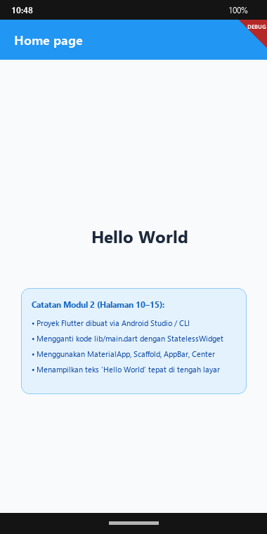
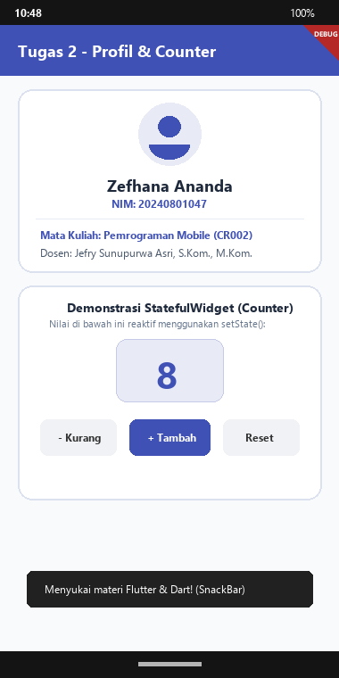

# Doc Tugas - Pertemuan 2: Konsep Dasar Arsitektur & Pemrograman Flutter

- **Nama Mahasiswa**: Zefhana Ananda
- **NIM**: 20240801047
- **Dosen Pengampu**: Jefry Sunupurwa Asri, S.Kom., M.Kom.
- **Mata Kuliah**: Pemrograman Mobile (CR002)
- **Fakultas**: Fakultas Ilmu Komputer, Universitas Esa Unggul

---

## Tangkapan Layar Hasil Running Aplikasi

### 1. Hasil Praktikum: Hello World Flutter (hello_app)


### 2. Hasil Tugas: Profil Mahasiswa & Counter Reaktif


---

## BAB I: Pendahuluan & Tujuan Pembelajaran
1. Mengenal framework Flutter dan bahasa Dart.
2. Memahami kelebihan Dart seperti Hot Reload (JIT) dan kompilasi AOT untuk performa tinggi.
3. Membuat aplikasi hello_app sesuai panduan Modul 2 halaman 10-15.
4. Belajar pakai StatefulWidget untuk mengelola state di aplikasi profil dan counter.

---

## BAB II: Dasar Teori
Flutter itu framework UI dari Google yang bisa dipakai bikin aplikasi di banyak platform sekaligus, dan pakai bahasa Dart. Arsitektur Flutter ada 3 tingkatan:
1. Framework (Dart): Di sini ada widget-widget Material dan Cupertino, animation, gesture, dan rendering.
2. Engine (C/C++): Bagian yang mengurus rendering grafis pakai Skia/Impeller, Dart VM, dan text layout.
3. Embedder: Penghubung antara engine Flutter dengan OS target (Android, iOS, Web, Desktop).
Dart punya fitur JIT buat Hot Reload waktu development, dan AOT buat compile ke native binary supaya app-nya kencang (60-120 fps).

---

## BAB III: Pelaksanaan Praktikum (Hello World Flutter (hello_app))
Praktikum 2 ini mengikuti langkah di Modul 2 halaman 10-15: bikin project 'hello_app', edit file lib/main.dart, lalu tampilin halaman dengan AppBar bertuliskan 'Home page' dan teks 'Hello World' di tengah layar pakai widget Center.

```dart
// Sesuai Modul 2 Halaman 13-14
void main() => runApp(const MyApp());

class MyApp extends StatelessWidget {
  @override
  Widget build(BuildContext context) {
    return MaterialApp(
      title: 'Hello World Demo Application',
      theme: ThemeData(primarySwatch: Colors.blue),
      home: const MyHomePage(title: 'Home page'),
    );
  }
}
```

---

## BAB IV: Pembahasan Tugas (Profil Mahasiswa & Counter Reaktif)
Di tugas 2, saya bikin aplikasi profil mahasiswa yang juga ada fitur counter. Ada info identitas saya, kartu penjelasan arsitektur Flutter, tombol Tambah, Kurang, dan Reset, plus tombol Favorit yang kalau diklik muncul SnackBar.

```dart
// lib/pert2/Tugas/tugas2_page.dart
void _increment() => setState(() => _counter++);
void _decrement() {
  if (_counter > 0) setState(() => _counter--);
}
void _reset() => setState(() => _counter = 0);
```

---

## Tabel Sintaks & Widget Penting
| Syntax / Widget | Fungsi |
| :--- | :--- |
| `MaterialApp` | Widget pembungkus utama untuk app berbasis Material Design. |
| `AppBar` | Header di bagian atas halaman, biasanya berisi judul. |
| `Center` | Widget buat menengahkan posisi child-nya. |
| `setState()` | Perintah supaya Flutter render ulang tampilan yang berubah. |
| `SnackBar` | Notifikasi singkat yang muncul di bawah layar. |
| `CircleAvatar` | Widget buat nampilin foto profil berbentuk lingkaran. |

---

## BAB V: Kesimpulan
1. Flutter itu beda dari framework lain karena dia render sendiri setiap piksel tanpa pakai bridge ke platform native, jadi lebih cepat.
2. Penting banget paham bedanya StatelessWidget dan StatefulWidget karena ini dasar dari cara kerja UI di Flutter.
3. Semua dependensi dan aset diatur lewat file pubspec.yaml, jadi pengelolaan project lebih terpusat.
