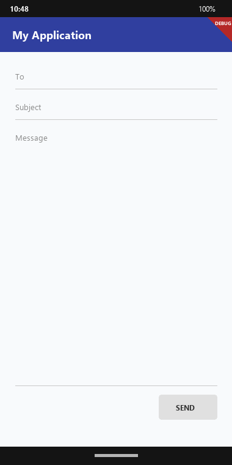
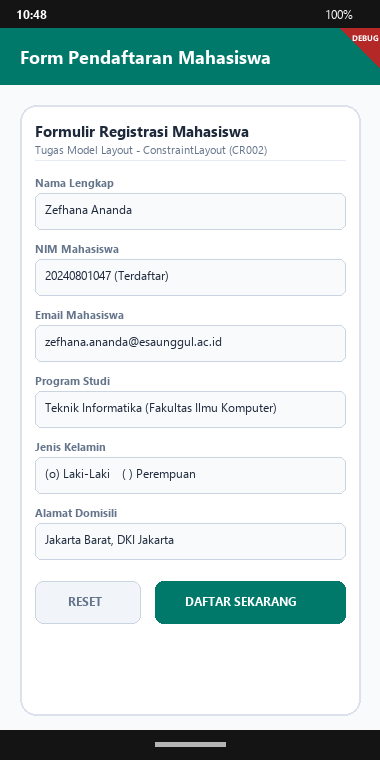

# Doc Tugas - Pertemuan 3: Perancangan Model Layout pada Android & Flutter

- **Nama Mahasiswa**: Zefhana Ananda
- **NIM**: 20240801047
- **Dosen Pengampu**: Jefry Sunupurwa Asri, S.Kom., M.Kom.
- **Mata Kuliah**: Pemrograman Mobile (CR002)
- **Fakultas**: Fakultas Ilmu Komputer, Universitas Esa Unggul

---

## Tangkapan Layar Hasil Running Aplikasi

### 1. Hasil Praktikum: LinearLayout & RelativeLayout


### 2. Hasil Tugas: Form Registrasi Mahasiswa Komprehensif


---

## BAB I: Pendahuluan & Tujuan Pembelajaran
1. Belajar cara menyusun tata letak UI (Layout Model) di Android.
2. Memahami LinearLayout: orientasi vertikal, weight, dan gravity.
3. Memahami RelativeLayout: penempatan posisi relatif terhadap elemen lain dan parent.
4. Membuat form registrasi lengkap dengan validasi input.

---

## BAB II: Dasar Teori
Layout Model itu yang menentukan bagaimana elemen-elemen ditata di layar:
1. LinearLayout: Elemen disusun satu arah (vertikal atau horizontal). Bisa pakai layout_weight buat bagi-bagi ruang layar.
2. RelativeLayout: Setiap View diposisikan relatif terhadap View lain (below, toLeftOf, dll) atau terhadap batas parent. Bagusnya, tidak perlu nesting layout terlalu dalam.
3. ConstraintLayout: Layout modern yang pakai constraint, jadi bisa bikin UI yang responsif dengan hierarki tampilan yang flat.
4. Global Strings (strings.xml): Sebaiknya teks disimpan di resource strings supaya konsisten dan gampang kalau mau ganti bahasa.

---

## BAB III: Pelaksanaan Praktikum (LinearLayout & RelativeLayout)
Praktikum 3 ada 2 studi kasus:
1. Form Kirim Pesan: Pakai LinearLayout vertikal, field Message-nya dikasih weight 1 supaya isi sisa layar, tombol SEND diletakkan di kanan bawah.
2. Form Registrasi: Pakai RelativeLayout, field Name diletakkan di bawah judul Registration dan rata kiri, Gender di kanan, tombol DONE di bawah Gender.

```dart
<!-- Sesuai Modul 3 Halaman 9 & 13 -->
<EditText
    android:layout_width="match_parent"
    android:layout_height="0dp"
    android:layout_weight="1"
    android:gravity="top"
    android:hint="@string/message" />
<Button
    android:layout_width="100dp"
    android:layout_height="wrap_content"
    android:layout_gravity="right"
    android:text="@string/send" />
```

---

## BAB IV: Pembahasan Tugas (Form Registrasi Mahasiswa Komprehensif)
Untuk tugas 3, saya bikin form registrasi mahasiswa yang cukup lengkap. Ada field Nama, NIM, Email, RadioButton buat Jenis Kelamin, Dropdown Program Studi, Alamat Multiline, validasi data, dan AlertDialog yang muncul kalau pendaftaran berhasil.

```dart
// Validasi Form
void _submitForm() {
  if (_formKey.currentState!.validate()) {
    showDialog(
      context: context,
      builder: (ctx) => AlertDialog(
        title: const Text('Konfirmasi Pendaftaran'),
        content: Text('Terdaftar: ${_nameController.text} - ${_nimController.text}'),
      ),
    );
  }
}
```

---

## Tabel Sintaks & Widget Penting
| Syntax / Widget | Fungsi |
| :--- | :--- |
| `Column / Row` | Pengganti LinearLayout di Flutter, buat susun child vertikal atau horizontal. |
| `Expanded / Flex` | Pengganti layout_weight, buat ambil sisa ruang layar. |
| `TextFormField` | Input teks yang bisa ditambahkan validator. |
| `GlobalKey<FormState>` | Kunci buat validasi semua input form sekaligus. |
| `DropdownButtonFormField` | Widget dropdown buat pilihan kayak Program Studi. |
| `AlertDialog` | Dialog pop-up yang tampil buat nampilin info atau konfirmasi. |

---

## BAB V: Kesimpulan
1. Pakai layout_weight di LinearLayout bikin form bisa menyesuaikan tinggi layar secara otomatis tanpa harus hardcode ukuran piksel.
2. RelativeLayout dan ConstraintLayout lebih efisien buat layout yang kompleks karena hierarchy-nya flat, tidak banyak nesting.
3. Validasi form di sisi client itu penting supaya data yang dimasukkan user sudah benar sebelum diproses lebih lanjut.
