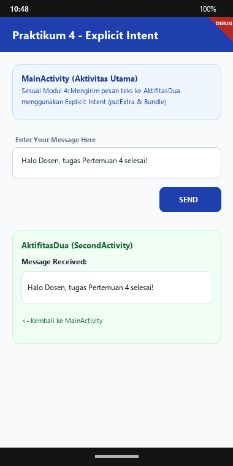
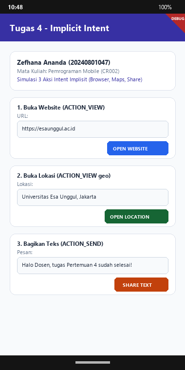

# Doc Tugas - Pertemuan 4: Pemodelan Activity dan Widget pada Android

- **Nama Mahasiswa**: Zefhana Ananda
- **NIM**: 20240801047
- **Dosen Pengampu**: Jefry Sunupurwa Asri, S.Kom., M.Kom.
- **Mata Kuliah**: Pemrograman Mobile (CR002)
- **Fakultas**: Fakultas Ilmu Komputer, Universitas Esa Unggul

---

## Tangkapan Layar Hasil Running Aplikasi

### 1. Hasil Praktikum: Explicit Intent (Kirim Pesan Antar Activity)


### 2. Hasil Tugas: Implicit Intent (Browser, Maps, & Share)


---

## BAB I: Pendahuluan & Tujuan Pembelajaran
1. Memahami konsep Activity (Aktivitas) pada aplikasi Android.
2. Mengetahui 4 komponen utama aplikasi Android (Activity, Service, Broadcast Receiver, Content Provider).
3. Memahami konsep dan perbedaan Explicit Intent serta Implicit Intent.
4. Mengimplementasikan perpindahan antar 2 Activity dan transfer data menggunakan Intent Extra (Bundle).

---

## BAB II: Dasar Teori
Aplikasi Android memiliki 4 komponen arsitektur utama:
1. Activity: Komponen visual antarmuka pengguna yang menjadi pintu interaksi pada layar perangkat.
2. Service: Komponen yang mengeksekusi proses di latar belakang (background) tanpa antarmuka langsung.
3. Broadcast Receiver: Komponen yang menerima dan merespons pesan pengumuman sistem/event (misal status baterai, alarm).
4. Content Provider: Pengelola dan penyedia akses pertukaran data antar aplikasi secara aman.

Intent adalah objek perantara pesan untuk meminta aksi antar komponen. Intent dibagi dua:
• Explicit Intent: Memanggil komponen/Activity spesifik di dalam aplikasi (contohnya MainActivity ke AktifitasDua).
• Implicit Intent: Meminta sistem Android menjalankan aksi umum via aplikasi luar (contohnya membuka URL web via browser, lokasi geo via Maps, dan aksi share).

---

## BAB III: Pelaksanaan Praktikum (Explicit Intent (Kirim Pesan Antar Activity))
Praktikum 4 mengimplementasikan panduan Modul 4 (halaman 6-15):
Membuat MainActivity dengan input teks 'Enter Your Message Here' dan tombol SEND. Ketika tombol diklik, aplikasi mengirimkan pesan ke AktifitasDua menggunakan Explicit Intent dan menampilkan pesan tersebut di bawah teks 'Message Received' dengan tombol kembali.

```dart
// Intent Eksplisit & Passing Data
Intent intent = new Intent(this, AktifitasDua.class);
String message = mMessageEditText.getText().toString();
intent.putExtra(EXTRA_MESSAGE, message);
startActivity(intent);

// Di AktifitasDua.java:
Intent intent = getIntent();
String message = intent.getStringExtra(MainActivity.EXTRA_MESSAGE);
textView.setText(message);
```

---

## BAB IV: Pembahasan Tugas (Implicit Intent (Browser, Maps, & Share))
Tugas 4 mengimplementasikan 3 variasi aksi Implicit Intent sesuai materi modul halaman 16-17: 1) Buka Website dengan aksi ACTION_VIEW (URL Esa Unggul), 2) Buka Lokasi Peta dengan aksi ACTION_VIEW geo (Google Maps), dan 3) Bagikan Teks dengan aksi ACTION_SEND (Share sheet ke aplikasi lain).

```dart
// Contoh Penerapan Implicit Intent
// 1. Open Website:
Uri webpage = Uri.parse("https://esaunggul.ac.id");
Intent webIntent = new Intent(Intent.ACTION_VIEW, webpage);

// 2. Open Location:
Uri addressUri = Uri.parse("geo:0,0?q=Universitas+Esa+Unggul");
Intent locIntent = new Intent(Intent.ACTION_VIEW, addressUri);

// 3. Share Text:
Intent shareIntent = new Intent(Intent.ACTION_SEND);
shareIntent.setType("text/plain");
shareIntent.putExtra(Intent.EXTRA_TEXT, "Halo Dosen, tugas selesai!");
```

---

## Tabel Sintaks & Widget Penting
| Syntax / Widget | Fungsi |
| :--- | :--- |
| `Intent` | Objek perantara untuk berpindah antar activity atau memanggil aksi sistem. |
| `putExtra()` | Menyisipkan data tambahan (key-value) ke dalam Intent untuk dikirim. |
| `getStringExtra()` | Mengambil nilai data teks yang dikirimkan oleh Intent pemanggil. |
| `startActivity()` | Memulai dan meluncurkan Activity target ke layar. |
| `ACTION_VIEW` | Aksi intent untuk menampilkan data kepada pengguna (web/maps). |
| `ACTION_SEND` | Aksi intent untuk membagikan data ke aplikasi lain (Share Sheet). |

---

## BAB V: Kesimpulan
1. Pemahaman siklus hidup Activity dan Intent adalah fondasi penting dalam navigasi dan komunikasi data aplikasi Android.
2. Explicit Intent sangat aman dan terarah untuk navigasi internal aplikasi antar layar.
3. Implicit Intent memungkinkan aplikasi berkolaborasi dengan aplikasi lain di dalam ekosistem sistem operasi Android secara fleksibel.
